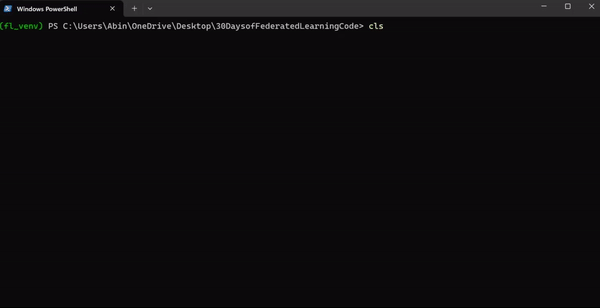

# What Happens During the Simulation?

Here's a quick rundown of what goes on during the federated learning simulation using the Flower framework:

---

## 1. Clients Load Data
- Each client is responsible for a specific "partition" of the dataset.  
- The simulation kicks off with clients loading their partitioned datasets (e.g., training and validation data).  
- The dataset in this case is **CIFAR-10**, split into 10 partitions, with 80% of the data used for training and 20% for validation.  

---

## 2. Server and Strategy Setup
- The server runs the **FedAvg** strategy, which orchestrates the training rounds.  
- It starts by sending out **initial model parameters** to all clients. These are just the weights of the model at the very beginning.

---

## 3. Training Round Begins
- The server selects a fraction of available clients (e.g., 30% of clients for training) to participate in the current round.  
- Each selected client:  
  1. **Receives the latest global model parameters** from the server.  
  2. **Trains the model locally** on its partitioned data for one epoch.  
  3. Sends back its updated model parameters to the server.  

---

## 4. Server Aggregates Updates
- Once the clients finish training, the server:  
  - Gathers all the updated parameters.  
  - Aggregates them using the **FedAvg algorithm** (a weighted average of client updates based on the number of samples each client trained on).  

---

## 5. Evaluation
- After updating the global model, the server evaluates its performance.  
- A fraction of clients is selected for evaluation. These clients:  
  - Receive the updated global model.  
  - Evaluate it on their local validation datasets.  
  - Send back metrics like **loss** and **accuracy**.  

---

## 6. Repeat for Multiple Rounds
- Steps 3 to 5 are repeated for a pre-defined number of rounds (in this case, 3 rounds).  
- With each round, the global model improves as it learns from more client data.  

---

## 7. Final Model
- After all rounds are completed, the server holds the final aggregated model, which has learned collaboratively from all clients' data.  
- This model can then be tested or deployed for real-world tasks.

---

That's it! The simulation essentially mimics a real-world federated learning setup where multiple devices (clients) collaboratively train a model without ever sharing their raw data. Neat, right?
