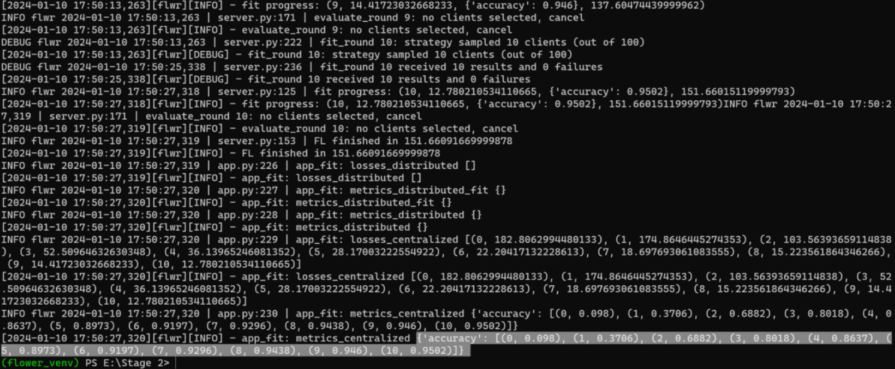

# Day 14 

## Step 5: Run the Simulation Implementing Federated Learning

In this step, we initiate the Federated Learning (FL) simulation, first on the CPU, and then demonstrate GPU resource allocation. The simulation tracks the experiment's history, using Independent and Identically Distributed (IID) data. 

The core of the simulation process involves calling Flower's `fl.simulation.start_simulation` method, passing various parameters.

### Key Elements:
- **Client Function (`client_fn`)**: This function spawns the clients for the simulation, with the number of clients (`num_clients`) fetched from the configuration file.
- **Federated Learning Rounds**: The number of rounds for the federated learning process is configured and managed by the server, which interacts with the strategy to orchestrate tasks like client configuration, model aggregation, and round iteration.

### Starting the Simulation

```python
history = fl.simulation.start_simulation(
    client_fn = client_fn,
    num_clients = config.number_of_clients,
    config = fl.server.ServerConfig(num_rounds = config.number_of_rounds),
    strategy = strategy,
    client_resources = {
        "num_cpus": 2,
        "num_gpus": 0.0,
    },
)
```

# So ...
This command kicks off the Federated Learning (FL) simulation, enabling the server to manage the iterative learning process. The server dynamically adjusts the models based on updates from clients after each round.

- Launches the FL simulation.
- Configures the number of clients and rounds for the process.
- Allocates resources (CPU and GPU) for simulation execution.
- Ensures a seamless FL process through dynamic model aggregation and client updates.

