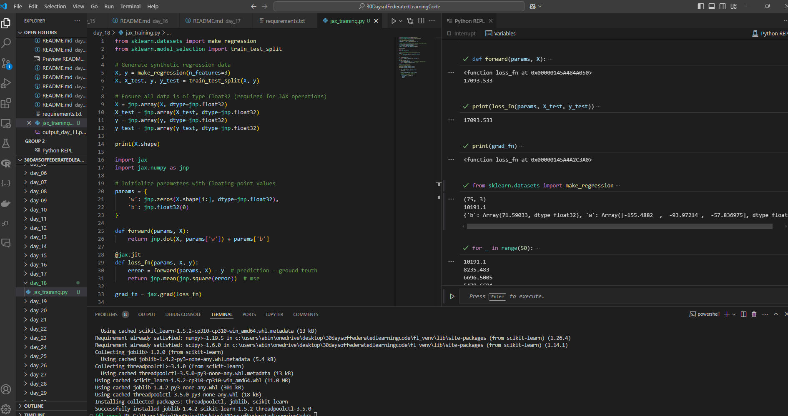

# Day 18: Linear Regression with JAX 🌟

Today, I worked on building a simple **linear regression model** using JAX, Google's high-performance library for machine learning. Here's a quick breakdown of what I achieved:

---

## 📊 Data Preparation  
- Used `scikit-learn` to generate synthetic regression data.
- Preprocessed the data by converting it to JAX-compatible formats (`float32`) for smooth operations.

---

## 🛠️ Model Definition  
- Created a basic linear regression model with weights and a bias term.
- Defined a **forward function** to compute predictions and a **loss function** to calculate the mean squared error (MSE).

---

## 🔄 Gradient Computation  
- Leveraged JAX's `grad` to compute the gradients of the loss function with respect to the model parameters.

---

## 📈 Training Loop  
- Iteratively updated the model parameters using the gradients.
- Observed how the loss decreased over multiple iterations, indicating the model was learning effectively.

---

## 🌍 What's Next?  
In the next step, I plan to extend this centralised training setup into a **federated learning framework** using **Flower**. The goal is to distribute the training across multiple clients while maintaining data privacy, a fascinating challenge I'm excited to tackle! 🚀
