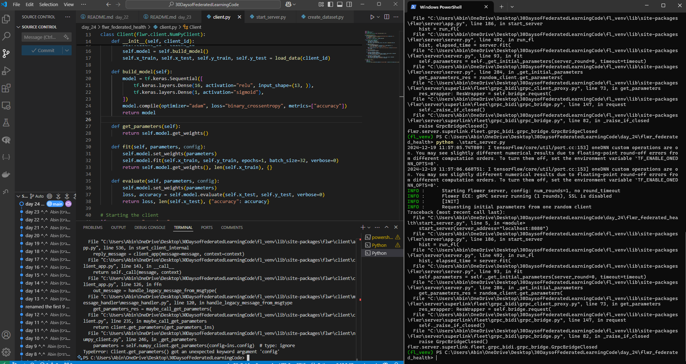

# day 25

This is what happened towards the end of day 24:

**encountered some bugs**

it was because there was a compatibility issue with `flwr`'s version.

Today, I will spend my time debugging it and try to make it run before i proceed.

### Fixed the bug:

took my almost an hour to realise what was happening. turns out the bug was because the method `Client.get_parameters()` doesn't expect a `config` argument, but Flower is passing one. 

**How i fixed it:**
I updated my `Client` class to handle the `config` argument in the `get_parameters()` method. simply added the `config = None` in the method's parameters.