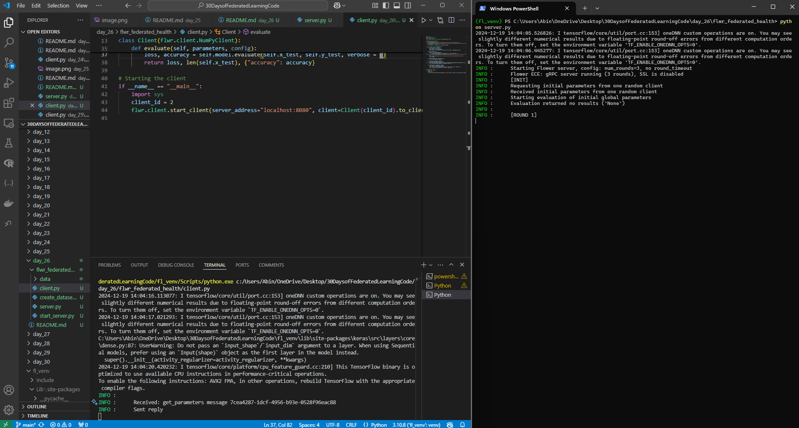

# day 26

this is the output:

## So what happened?

### Server is running:
- the server has started successfully, and it's waiting for clients to connect.
- the server is requesting the initial model parameters from a connected client. these parameters are used to initialise the global model.
- Evaluation returned no results: this happens because the server attempted to evaluate the global model (before any training), but no evaluation logic was given. this is fine since I didn't require server-side evaluation at this stage.
- [ROUND 1]: the first training is about to begin. once clients complete their trianing, the server will aggregate the updates and move to the next round.

### Client output:
- the client received a message from the server to privde its model  parameters. this is the **intialisation phase.**
- sent reply: the client successfully sent its model parameters back to the server.