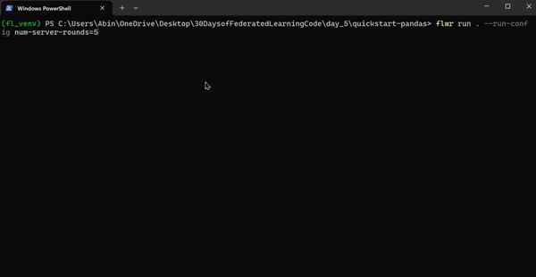

# Federated Learning with Pandas and Flower (Quickstart Example)


This introductory example to Flower uses [Pandas](https://pandas.pydata.org/), but deep knowledge of Pandas is not necessarily required to run the example. However, it will help you understand how to adapt Flower to your use case. This example uses [Flower Datasets](https://flower.ai/docs/datasets/) to
download, partition and preprocess the [Iris dataset](https://huggingface.co/datasets/scikit-learn/iris).
Running this example in itself is quite easy.

This example implements a form of Federated Analyics by which instead of training a model using locally available data, the nodes run a query on the data they own. In this example the query is to compute the histogram on specific columns of the dataset. These metrics are sent to the `ServerApp` for aggregation.


```shell
quickstart-pandas
├── pandas_example
│   ├── __init__.py
│   ├── client_app.py   # Defines your ClientApp
│   └── server_app.py   # Defines your ServerApp
├── pyproject.toml      # Project metadata like dependencies and configs
└── README.md
```

### Install dependencies and project

Install the dependencies defined in `pyproject.toml` as well as the `pandas_example` package.

```bash
pip install -e .
```

## Run the project

You can run your Flower project in both _simulation_ and _deployment_ mode without making changes to the code. If you are starting with Flower, we recommend you using the _simulation_ mode as it requires fewer components to be launched manually. By default, `flwr run` will make use of the Simulation Engine.

### Run with the Simulation Engine

```bash
flwr run .
```

You can also override some of the settings for your `ClientApp` and `ServerApp` defined in `pyproject.toml`. For example

```bash
flwr run . --run-config num-server-rounds=5
```

> \[!TIP\]
> For a more detailed walk-through check our [quickstart PyTorch tutorial](https://flower.ai/docs/framework/tutorial-quickstart-pandas.html)

### Run with the Deployment Engine

> \[!NOTE\]
> An update to this example will show how to run this Flower application with the Deployment Engine and TLS certificates, or with Docker.
